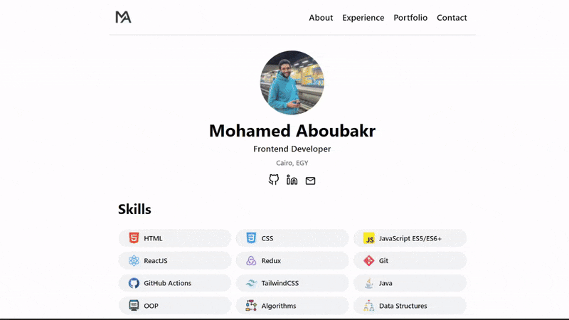
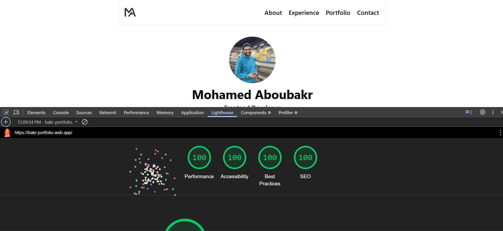

# Portfolio 

Developer portfolio site built with **React.js** and **TailwindCSS**. View it here: [https://bakr-portfolio.web.app](https://bakr-portfolio.web.app)



```bash
v1 Portfolio Site - Apr 2025-present
bakr-portfolio.web.app (Firebase Hosting + Emulator Suite)
```

## 🛠️ Built With
- **React.js**
- **TailwindCSS**
- **Firebase**

## 🎯 Lighthouse Score


## Local Development
### Prerequisites
- **Node.js :** Download and install from [https://nodejs.org/en](https://nodejs.org/en) (includes npm)

### Navigate to Desktop from CMD or any Shell
```bash
cd Desktop
```

### Clone the repo
```bash
git clone git@github.com:Mabubakr2001/bakr-portfolio.git
```

### Navigate to the folder
```bash
cd bakr-portfolio
```

### Install the needed 
```bash
npm install
```

### Run the localhost
```bash
npm run dev
```